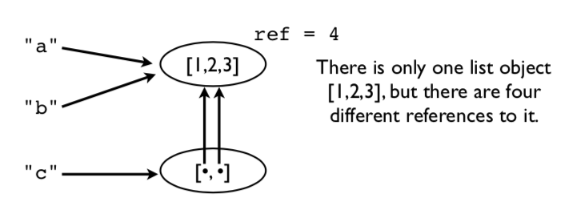
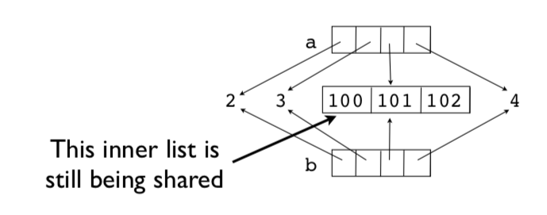

[Contents](../Contents.md) \| [Previous (2.6 List Comprehensions)](06_List_comprehension.md) \| [Next (3 Program Organization)](../03_Program_organization/00_Overview.md)

# 2.7 Objects

This section introduces more details about Python's internal object model and
discusses some matters related to memory management, copying, and type checking.

### Assignment

Many operations in Python are related to *assigning* or *storing* values.

```python
a = value         # Assignment to a variable
s[n] = value      # Assignment to a list
s.append(value)   # Appending to a list
d['key'] = value  # Adding to a dictionary
```

*A caution: assignment operations **never make a copy** of the value being assigned.*
All assignments are merely reference copies (or pointer copies if you prefer).

### Assignment example

Consider this code fragment.

```python
a = [1,2,3]
b = a
c = [a,b]
```

A picture of the underlying memory operations. In this example, there
is only one list object `[1,2,3]`, but there are four different
references to it.



This means that modifying a value affects *all* references.

```python
>>> a.append(999)
>>> a
[1,2,3,999]
>>> b
[1,2,3,999]
>>> c
[[1,2,3,999], [1,2,3,999]]
>>>
```

Notice how a change in the original list shows up everywhere else
(yikes!).  This is because no copies were ever made. Everything is
pointing to the same thing.

### Reassigning values

Reassigning a value *never* overwrites the memory used by the previous value.

```python
a = [1,2,3]
b = a
a = [4,5,6]

print(a)      # [4, 5, 6]
print(b)      # [1, 2, 3]    Holds the original value
```

Remember: **Variables are names, not memory locations.**

### Some Dangers

If you don't know about this sharing, you will shoot yourself in the
foot at some point.  Typical scenario. You modify some data thinking
that it's your own private copy and it accidentally corrupts some data
in some other part of the program.

*Comment: This is one of the reasons why the primitive datatypes (int,
 float, string) are immutable (read-only).*

### Identity and References

Use the `is` operator to check if two values are exactly the same object.

```python
>>> a = [1,2,3]
>>> b = a
>>> a is b
True
>>>
```

`is` compares the object identity (an integer).  The identity can be
obtained using `id()`.

```python
>>> id(a)
3588944
>>> id(b)
3588944
>>>
```

Note: It is almost always better to use `==` for checking objects.  The behavior
of `is` is often unexpected:

```python
>>> a = [1,2,3]
>>> b = a
>>> c = [1,2,3]
>>> a is b
True
>>> a is c
False
>>> a == c
True
>>>
```

### Shallow copies

Lists and dicts have methods for copying.

```python
>>> a = [2,3,[100,101],4]
>>> b = list(a) # Make a copy
>>> a is b
False
```

It's a new list, but the list items are shared.

```python
>>> a[2].append(102)
>>> b[2]
[100,101,102]
>>>
>>> a[2] is b[2]
True
>>>
```

For example, the inner list `[100, 101, 102]` is being shared.
This is known as a shallow copy.  Here is a picture.



### Deep copies

Sometimes you need to make a copy of an object and all the objects contained within it.
You can use the `copy` module for this:

```python
>>> a = [2,3,[100,101],4]
>>> import copy
>>> b = copy.deepcopy(a)
>>> a[2].append(102)
>>> b[2]
[100,101]
>>> a[2] is b[2]
False
>>>
```

### Names, Values, Types

Variable names do not have a *type*. It's only a name.
However, values *do* have an underlying type.

```python
>>> a = 42
>>> b = 'Hello World'
>>> type(a)
<type 'int'>
>>> type(b)
<type 'str'>
```

`type()` will tell you what it is. The type name is usually used as a function
that creates or converts a value to that type.

### Type Checking

How to tell if an object is a specific type.

```python
if isinstance(a, list):
    print('a is a list')
```

Checking for one of many possible types.

```python
if isinstance(a, (list,tuple)):
    print('a is a list or tuple')
```

*Caution: Don't go overboard with type checking. It can lead to
excessive code complexity.  Usually you'd only do it if doing
so would prevent common mistakes made by others using your code.
*

### Everything is an object

Numbers, strings, lists, functions, exceptions, classes, instances,
etc. are all objects.  It means that all objects that can be named can
be passed around as data, placed in containers, etc., without any
restrictions.  There are no *special* kinds of objects.  Sometimes it
is said that all objects are "first-class".

A simple example:

```python
>>> import math
>>> items = [abs, math, ValueError ]
>>> items
[<built-in function abs>,
  <module 'math' (builtin)>,
  <type 'exceptions.ValueError'>]
>>> items[0](-45)
45
>>> items[1].sqrt(2)
1.4142135623730951
>>> try:
        x = int('not a number')
    except items[2]:
        print('Failed!')
Failed!
>>>
```

Here, `items` is a list containing a function, a module and an
exception.  You can directly use the items in the list in place of the
original names:

```python
items[0](-45)       # abs
items[1].sqrt(2)    # math
except items[2]:    # ValueError
```

With great power comes responsibility.  Just because you can do that doesn't mean you should.

## Exercises

In this set of exercises, we look at some of the power that comes from first-class
objects.

### Exercise 2.24: First-class Data

In the file `Data/portfolio.csv`, we read data organized as columns that look like this:

```csv
name,shares,price
"AA",100,32.20
"IBM",50,91.10
...
```

In previous code, we used the `csv` module to read the file, but still
had to perform manual type conversions. For example:

```python
for row in rows:
    name   = row[0]
    shares = int(row[1])
    price  = float(row[2])
```

This kind of conversion can also be performed in a more clever manner
using some list basic operations.

Make a Python list that contains the names of the conversion functions
you would use to convert each column into the appropriate type:

```python
>>> types = [str, int, float]
>>>
```

The reason you can even create this list is that everything in Python
is *first-class*.  So, if you want to have a list of functions, that’s
fine.  The items in the list you created are functions for converting
a value `x` into a given type (e.g., `str(x)`, `int(x)`, `float(x)`).

Now, read a row of data from the above file:

```python
>>> import csv
>>> f = open('Data/portfolio.csv')
>>> rows = csv.reader(f)
>>> headers = next(rows)
>>> row = next(rows)
>>> row
['AA', '100', '32.20']
>>>
```

As noted, this row isn’t enough to do calculations because the types
are wrong. For example:

```python
>>> row[1] * row[2]
Traceback (most recent call last):
  File "<stdin>", line 1, in <module>
TypeError: can't multiply sequence by non-int of type 'str'
>>>
```

However, maybe the data can be paired up with the types you specified
in `types`. For example:

```python
>>> types[1]
<type 'int'>
>>> row[1]
'100'
>>>
```

Try converting one of the values:

```python
>>> types[1](row[1])     # Same as int(row[1])
100
>>>
```

Try converting a different value:

```python
>>> types[2](row[2])     # Same as float(row[2])
32.2
>>>
```

Try the calculation with converted values:

```python
>>> types[1](row[1])*types[2](row[2])
3220.0000000000005
>>>
```

Zip the column types with the fields and look at the result:

```python
>>> r = list(zip(types, row))
>>> r
[(<type 'str'>, 'AA'), (<type 'int'>, '100'), (<type 'float'>,'32.20')]
>>>
```

You will notice that this has paired a type conversion with a
value. For example, `int` is paired with the value `'100'`.

The zipped list is useful if you want to perform conversions on all of
the values, one after the other. Try this:

```python
>>> converted = []
>>> for func, val in zip(types, row):
          converted.append(func(val))
...
>>> converted
['AA', 100, 32.2]
>>> converted[1] * converted[2]
3220.0000000000005
>>>
```

Make sure you understand what’s happening in the above code.  In the
loop, the `func` variable is one of the type conversion functions
(e.g., `str`, `int`, etc.) and the `val` variable is one of the values
like `'AA'`, `'100'`.  The expression `func(val)` is converting a
value (kind of like a type cast).

The above code can be compressed into a single list comprehension.

```python
>>> converted = [func(val) for func, val in zip(types, row)]
>>> converted
['AA', 100, 32.2]
>>>
```

### Exercise 2.25: Making dictionaries

Remember how the `dict()` function can easily make a dictionary if you
have a sequence of key names and values?  Let’s make a dictionary from
the column headers:

```python
>>> headers
['name', 'shares', 'price']
>>> converted
['AA', 100, 32.2]
>>> dict(zip(headers, converted))
{'price': 32.2, 'name': 'AA', 'shares': 100}
>>>
```

Of course, if you’re up on your list-comprehension fu, you can do the
whole conversion in a single step using a dict-comprehension:

```python
>>> { name: func(val) for name, func, val in zip(headers, types, row) }
{'price': 32.2, 'name': 'AA', 'shares': 100}
>>>
```

### Exercise 2.26: The Big Picture

Using the techniques in this exercise, you could write statements that
easily convert fields from just about any column-oriented datafile
into a Python dictionary.

Just to illustrate, suppose you read data from a different datafile like this:

```python
>>> f = open('Data/dowstocks.csv')
>>> rows = csv.reader(f)
>>> headers = next(rows)
>>> row = next(rows)
>>> headers
['name', 'price', 'date', 'time', 'change', 'open', 'high', 'low', 'volume']
>>> row
['AA', '39.48', '6/11/2007', '9:36am', '-0.18', '39.67', '39.69', '39.45', '181800']
>>>
```

Let’s convert the fields using a similar trick:

```python
>>> types = [str, float, str, str, float, float, float, float, int]
>>> converted = [func(val) for func, val in zip(types, row)]
>>> record = dict(zip(headers, converted))
>>> record
{'volume': 181800, 'name': 'AA', 'price': 39.48, 'high': 39.69,
'low': 39.45, 'time': '9:36am', 'date': '6/11/2007', 'open': 39.67,
'change': -0.18}
>>> record['name']
'AA'
>>> record['price']
39.48
>>>
```

Bonus: How would you modify this example to additionally parse the
`date` entry into a tuple such as `(6, 11, 2007)`?

Spend some time to ponder what you’ve done in this exercise. We’ll
revisit these ideas a little later.

[Contents](../Contents.md) \| [Previous (2.6 List Comprehensions)](06_List_comprehension.md) \| [Next (3 Program Organization)](../03_Program_organization/00_Overview.md)
